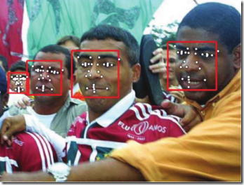

# 人脸识别

## 基本问题

我们常说``人脸识别``。实际上``人脸识别``细分4个领域，分别是：

- **人脸检测** ``face detection``：从一张图中识别出人脸位置
- **人脸校准/人脸标点** ``face alignment``： 给你一张脸，找出我需要的特征点的位置，比如鼻子左侧，鼻孔下侧，瞳孔位置，上嘴唇下侧等等点的位置
- ``recognization``：``recognization``又进一步细分 **人脸校验**(``verification``)和 **人脸识别**(``identification``)
  - **人脸校验** ``face verification``: 给你两张脸问你是不是同一个人
  - **人脸识别** ``face identification``: 给你一张脸和一个库问你这张脸是库里的谁

**注意**: 前3项并不需要库；后1项才需要库。

## JDA算法

**Joint Cascade Face Detection and Alignment（ECCV14)**

>ECCV14表示该论文是2014年的，ECCV是欧洲计算机视觉国际会议（``European Conference on Computer Vision``）。目前，公认的计算机视觉三大会议分别为 ``ICCV``,``ECCV``,``CVPR``。

人脸检测（detection）在opencv中早就有直接能拿来用的haar分类器，基于Viola-Jones算法。
但是毕竟是老掉牙的技术，Precision/Recall曲线渣到不行，在实际工程中根本没法给boss看。

作为MSRA脑残粉，这里介绍一种MSRA在14年的最新技术：Joint Cascade Face Detection and Alignment（ECCV14)。这篇文章直接在30ms的时间里把``detection``和``alignment``都给做了，PR曲线彪到很高，时效性高，内存占用却非常低，在一些库上虐了 **Face++** 和 **Google Picasa**，正好契合这篇想讲的东西。

人脸校准（``alignment``）是给你一张脸，你给我找出我需要的特征点的位置，比如鼻子左侧，鼻孔下侧，瞳孔位置，上嘴唇下侧等等点的位置。

图中红色框框就是在做detection，白色点点就是在做alignment。

## 评测平台

**Face Detection Data Set and Benchmark（FDDB）**

网址：http://vis-www.cs.umass.edu/fddb/results.html

FDDB是由马萨诸塞大学计算机系维护的一套公开数据库，为来自全世界的研究者提供一个标准的人脸检测评测平台，其中涵盖在自然环境下的各种姿态的人脸；该校还维护了LFW等知名人脸数据库供研究者做人脸识别的研究。作为全世界最具权威的人脸检测评测平台之一，FDDB使用Faces
 in the Wild数据库中的包含5171张人脸的2845张图片作为测试集，而其公布的 **评测集** 也代表了人脸检测的世界最高水平。

## 识别难题

- 跨年龄识别
- 戴墨镜和围巾遮挡：人脸被遮挡后，会发展步态识别和声音识别
